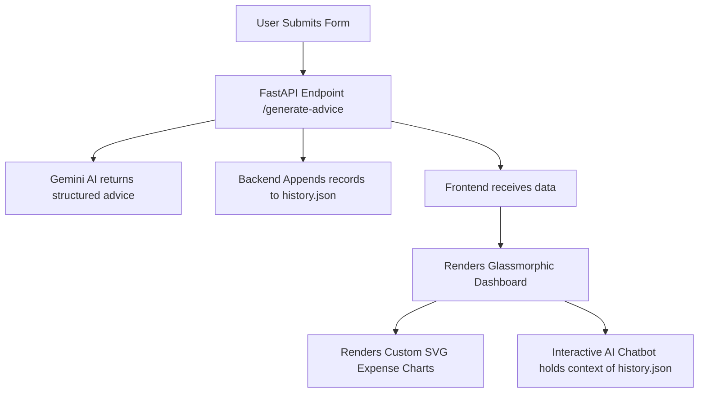

# 🚀 TCS AI Friday: Video Script & Master Upgrade Blueprint
This document serves as your complete guide to recording a stellar demonstration video for your mentor. It outlines the exact step-by-step flow, script guidelines, and includes a **Master Upgrade Prompt** to integrate **Visual Analytics**, **JSON Storage**, and an **Interactive AI Financial Chatbot**.

---

## 📺 Section 1: Video Recording & Script Flow (Hinglish/English)

Use this timeline and talk track to record your screen capture in VS Code and the browser.

### 🎥 Step 1: Introduction & The Seed Prompt (0:00 - 1:00)
*   **What to show on screen**: Open VS Code with an empty directory. Show the first "Seed Prompt" written in a text file.
*   **What to say**:
    > "Hey everyone! Welcome to my demonstration for TCS AI Friday. Today, we are going to build a GenAI-Powered Personalized Financial Advisor from absolute scratch using structured prompting and AI assistance. 
    > We start by defining our problem statement: customers want personalized, actionable advice tailored to their expenses rather than generic templates. Let's see how our AI engine researches this problem and suggests a high-performance tech stack."

### 🔬 Step 2: Tech Stack Selection & Architecture (1:00 - 2:00)
*   **What to show on screen**: Show the AI response outlining the architecture.
*   **What to say**:
    > "Based on our requirements for speed, security, and beauty, we chose a modern decoupled stack:
    > - **Frontend**: React + Vite + Tailwind CSS for a stunning dark-theme neomorphic banking dashboard.
    > - **Backend**: FastAPI (Python) for ultra-fast performance, direct Pydantic validations, and clean CORS setup.
    > - **GenAI Model**: Google Gemini-2.5-Flash integrated securely via OpenRouter."

### 💻 Step 3: Frontend & Backend Code Generation (2:00 - 4:00)
*   **What to show on screen**: Speed-scroll through your beautifully structured folders (`frontend/src/components`, `backend/services`, etc.). Focus on files like `FinancialForm.jsx` (showing the live calculators) and `gemini.py` (showing the structured prompt).
*   **What to say**:
    > "Here is our completed project structure. Look how clean and modular it is!
    > In `FinancialForm.jsx`, we built a client-side calculator that computes expense ratios and savings potentials in real-time as the user types. 
    > On the backend, in `gemini.py`, we designed a robust, system-level structured prompt that forces the GenAI model to return a strict, parsed JSON matching our Pydantic schemas. This guarantees zero parsing errors!"

### 🏃‍♂️ Step 4: Starting the Dev Environments (4:00 - 5:00)
*   **What to show on screen**: Split terminal in VS Code. On the left side, run `python main.py` in the backend virtual env. On the right side, run `npm run dev` in the frontend directory.
*   **What to say**:
    > "Let's run the servers! The FastAPI backend starts on port 8000. Our React frontend compiles beautifully and fires up on port 3000. Our health-checks run in the background, showing us that our Gemini core connection is fully active."

### 🌟 Step 5: Dashboard Demo & AI Outputs (5:00 - 7:00)
*   **What to show on screen**: Go to the browser (`http://localhost:3000`). Click **"Premier Tier"** to auto-fill the inputs. Show the live calculator updating. Click **"Generate"**, wait for the rotating vault loading spinner, and then browse through the tabbed dashboard cards (Budget, Savings, Investments).
*   **What to say**:
    > "And here is the live application! Notice the gorgeous glassmorphic cards, custom neon gradients, and premium Outfit typography. 
    > We select a preset, hit generate, and our custom vault spinner triggers. Within seconds, the AI returns parsed, bulleted wealth blueprints covering spending, budget optimization, emergency reserves, and asset allocations. We can even click export to print our customized financial report!"

---

## 🛠️ Section 2: Master Upgrade Prompt (Copy-Paste to AI)

Use this structured prompt to have the AI implement **Visual Analytics**, **JSON Storage**, and the **Interactive Chatbot** in one single shot.

```markdown
Title: Upgrade ApexWealth with Visual Analytics, JSON History, and Financial Chatbot

We have a working React + Vite + Tailwind CSS frontend and a FastAPI backend that talks to OpenRouter.
I want to upgrade this project to add three premium features:
1. VISUAL ANALYTICS: Show expense distributions using beautiful SVG-based visual graphs/progress bars or interactive custom CSS charts (avoiding heavy external libraries to prevent install version conflicts).
2. BACKEND JSON HISTORY: When advice is generated, append the transaction input and AI response payload into a local JSON file (`backend/data/history.json`) with timestamps. Add a `/history` GET endpoint to fetch past advice.
3. FOLLOW-UP FINANCIAL CHATBOT: Add a chat interface below the advice dashboard. When user asks a question, call OpenRouter passing the context of their generated financial advice so they can have a follow-up conversation about their actual numbers.

Please provide the updated files with COMPLETE implementations:
- `backend/schemas/advice.py` (Include Chat schemas & History storage models)
- `backend/main.py` (Add /history, /chat, and JSON logging logic)
- `backend/services/gemini.py` (Add follow-up chat prompt endpoint)
- `frontend/src/services/api.js` (Add axios bindings for chat and history)
- `frontend/src/components/AdviceDashboard.jsx` (Integrate the SVG Visual Analytics & Chatbot Drawer component)
```

---

## 📐 Section 3: Visual Analytics & Storage Flow



---

## 💬 Section 4: High-Impact Chatbot Demo Prompts

Copy and paste these exact questions during your video demonstration to show your mentor how the AI chatbot dynamically acts as a certified personal financial advisor.

### 📝 Prompt 1: Budget Optimization
*   **Copy-paste this**:
    > "Based on my numbers, my Food and Shopping expenses look high. Can you give me a realistic weekly meal-prep strategy and a 50/30/20 rule breakdown to save $150 more each month?"
*   **What this shows**: Shows the AI parsing their specific food/shopping input values, calculating a customized target savings increase, and giving a concrete weekly action plan.

### 📝 Prompt 2: Emergency Fund Timeline
*   **Copy-paste this**:
    > "You recommended a 3-6 month emergency fund. Based on my total monthly expenses, what is the exact amount I should target for a 4-month cushion, and how many months will it take me to build it if I save $400/month?"
*   **What this shows**: Shows the AI multiplying their actual total monthly expenses by 4, comparing it to a $400 monthly savings rate, and returning the exact mathematical target and month-by-month timeline.

### 📝 Prompt 3: Investment Vehicle Selection
*   **Copy-paste this**:
    > "Since my goal timeline is short, what is the exact difference in returns between a High-Yield Savings Account (HYSA) at 4.5% vs an Index Fund for my money? Which one is safer for my timeline?"
*   **What this shows**: Shows the AI analyzing their specific timeline parameter (e.g. 12 months) and advising on risk management, explaining compound interest vs. stock market volatility.

### 📝 Prompt 4: Real-time Expense Prioritization
*   **Copy-paste this**:
    > "If I decide to cut my entertainment budget in half starting tomorrow, how much faster will I achieve my target savings goal? Give me the updated month timeline."
*   **What this shows**: Shows the chatbot doing live math on the spot, dividing the original entertainment expense by 2, adding it to their savings capacity, and calculating the accelerated completion date.

